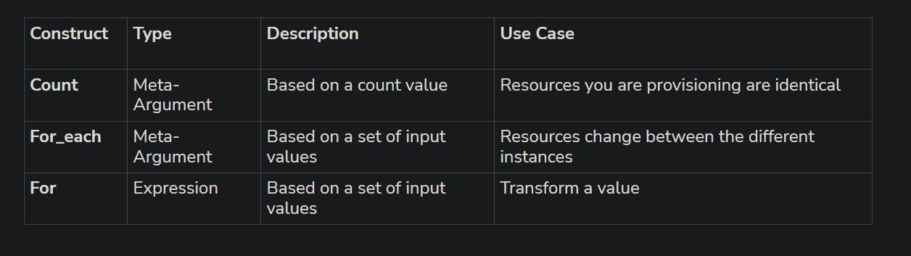

## Terraform Variables

- Terraform variables provides a way to store the values and can be used throughout your terraform configuration.

Variables are defined in the variables block in your Terraform configuration file, where you can give a name and a default value. Please refer to the following snippet exaplaining how variables are defined inside terraform-

```
variable "<variable_name>" {
    type = string
    description = "some desc"
    default = "<default value>"
}
```

- Terraform variables can have various type such as string, number, boolean, list, map etc.
- Variables can be set in the command line when running Terraform commands using the `-var flag`.
- Variables can also be set using a separate file, called a variable file, using the `-var-file flag`.
- Variables can be accessed in Terraform configuration files using the var function, for example ` var.example_variable`.
- Variables are useful for storing values that may change between environments, for example, different values for test and production environments.

### Defining a list variable

```
variable "storage_account_name" {
  type    = list(string)
  default = ["sauk02", "sauk03", "sauk04"]
}

resource "azurerm_storage_account" "example" {
  name                     = var.storage_account_name[count.index]
  resource_group_name      = azurerm_resource_group.example.name
  location                 = azurerm_resource_group.example.location
  account_tier             = "Standard"
  account_replication_type = "LRS"
  count                    = length(var.storage_account_name)
}
```

### Output variables

Output variables allow you to easily extract information about the resources that were created by Terraform. They allow you to easily reference the values of resources after Terraform has finished running.

Output variables are defined in the outputs block in the Terraform configuration file. Here's an example

```
output "example" {
  value = azurerm_storage_account.example[2].id
}
```

you use `terraform output`command to see Id for the above example.

## What is a Map in terraform ?

Map is a data structure used to represent a collection of key-value pairs. It's is similar to objects in other programming languages. you can define map as below

```
variable "<variable_name>" {
  type = map(string)
  default = {
    luke  = "jedi"
    yoda  = "jedi"
    darth = "sith"
  }
}
```

The following types can be used to define your map:

- map(string): The values in the map are of type “string.”
- map(number): The values in the map are of type “number” (integer or floating-point).
- map(bool): The values in the map are of type “bool” (true or false).
- map(list): The values in the map are lists (arrays) containing elements of the same type.
- map(set): The values in the map are sets containing unique elements of the same type.
- map(object({ ... })): The values in the map are objects (complex data structures) that must conform to a specific structure defined by the object’s attributes.

## What is a Object in terraform ?

An object is complex data structure that contains multiple attributes with specific types defined for each attribute. example is below:

```
variable "example_object" {
  type = object({
    attribute1 = string
    attribute2 = number
    attribute3 = bool
  })
  default = {
    attribute1 = "value1"
    attribute2 = 2
    attribute3 = true
  }
}
```

## What is the difference between Map and Object in terraform ?

- An object is a map without a defined type.
- For example you can have a map(string) that only accepts string values and an object that is the same but can contain different types in addition to strings.

## Terraform variable loading preference - How do terraform loads variables?

Terraform loads variables in the following order:

- Environment variables (`TF_VAR_` prefix).
- Command-line flags (-var and -var-file).
- terraform.tfvars and terraform.tfvars.json.
- Any .auto.tfvars or .auto.tfvars.json files.
- Variable definitions in the configuration.
- Prompting the user for input if the variable is not set.

## Terraform locals

If you are working on a large enterprise infrastructure then it is impossible to work without Terraform Locals. But let's see the benefits of using terraform locals in a bit more detail -

Terraform locals can be re-used multiple numbers of times in the terraform configuration file.
It can reduce the work of updating your terraform configuration at multiple places. With terraform locals you need to update its value once and it should reflect all over the place where it is referred.

While input variables (variables.tf) are used to accept values from the user or calling module, locals are intended for internal computation and managing repeated or derived values within the Terraform configuration. They enhance readability, reduce redundancy, and allow for more maintainable and organized code.

## Count Meta-argument.

The Terraform count meta-argument simplifies the creation of multiple resource instances without having to repeat the same resource block multiple times. It can be used with both resource and module blocks. To use the count meta-argument, you need to specify the count argument within a block, which accepts a whole number value representing the number of instances you want to create.

Example below:

```
resource "azurerm_storage_account" "example" {
  name                     = var.storage_account_name[count.index]
  resource_group_name      = azurerm_resource_group.example.name
  location                 = azurerm_resource_group.example.location
  account_tier             = "Standard"
  account_replication_type = "LRS"
  count                    = length(var.storage_account_name)
}
```

### Terraform count limitations

While the count meta argument is a powerful feature, there are some limitations and considerations:

- Limited dynamic scaling: The count argument is evaluated during the planning phase, and the resources are provisioned based on that count. If you need dynamic scaling (e.g., adjusting the count based on runtime conditions), Terraform’s count might not be the most suitable option.
- Limited Logic: The count feature primarily relies on simple numeric values. If you need more complex logic or conditional creation of resources, you might need to consider other features like Terraform `for_each`.
- Unintended changes based on ordering: When using count, the resource instances are identified by an index. Modifying an element anywhere in between the list causes unintended changes for all subsequent elements.
- count arguments cannot be directly used on sets and maps because they don't have any concept of indexing.

**Count on maps**

```
variable "my_map" {
  type = map(string)
  default = {
    key1 = "value1"
    key2 = "value2"
    key3 = "value3"
  }
}

locals {
  my_keys = keys(var.my_map)
}

resource "my_resource" "example" {
  count = length(local.my_keys)

  name  = local.my_keys[count.index]
  value = var.my_map[local.my_keys[count.index]]
  # Additional resource configuration...
}
```

Note: Keys function will return a list.

## What is Terraform for_each ?

Terraform `for_each` is a meta argument that helps in creating multiple instances of a defined resource. It also provides us with the flexibility of dynamically setting the attributes of each resource instance created, depending on the type of variables being used to create real-world replicas.

`for_each` primarily works with a set of strings `(set(string))` and map of strings `(map(string))`. The provided string values are used to set instance specific attributes.

### Why for_each Doesn't Directly Support Lists ?

- **Explicit Keys for Resource Management:** Terraform uses keys to uniquely identify each instance of a resource. Lists inherently use integer indices as keys, but these indices can lead to unintended resource replacements if the list order changes.
- **Resource Addressing Stability:** Explicitly defined keys provide stability in resource addressing. This stability is crucial for maintaining the state file and avoiding resource churn.

Example:

```
variable "storage_account_name" {
  type    = set(string)
  default = ["sauks028742", "sauks03", "sauks04"]
}

resource "azurerm_storage_account" "example" {
  for_each                 = var.storage_account_name
  name                     = each.value
  resource_group_name      = azurerm_resource_group.example.name
  location                 = azurerm_resource_group.example.location
  account_tier             = "Standard"
  account_replication_type = "LRS"
  tags = {
    Name = each.value
    ID   = each.key
  }
}
```

## What is the difference between for_each and count ?

- count works with lists and will use indexing to fetch the values. Whereas for_each works with a map or set, and keys are used to fetch values.
- If you remove an item from the middle of your list using count, every item after it will move down to take its place and terraform will create them all over again. With for_each each instance will be having a key, eventhough if we remove one item it won't creata any impact.
- for_each will give you more freedom and control.

## For loop in terraform

Unlike count and for_Each, the for expression primary purpose is not to deploy multiple resources. It is instead a method by which variables containing lists,sets,tuples or maps can be transformed or filtered to perform other operations.


## Terraform Dynamic Variables

Dynamic blocks in azure let you to repeat configurations insdie a resource/provisioner.datasource on variables/local/expression inside them.
Apart from keeping your configuration DRY, Dynamic Blocks also help you generate dynamic configurations based on your input, enabling your modules to accommodate several different use cases.

**Example:**

```
resource "azurerm_virtual_network" "dynamic_block" {
  name                = "vnet-dynamicblock-example-centralus"
  resource_group_name = azurerm_resource_group.dynamic_block.name
  location            = azurerm_resource_group.dynamic_block.location
  address_space       = ["10.10.0.0/16"]

  dynamic "subnet" {
    for_each = var.subnets
    iterator = item
    content  {
      name = item.value.name
      address_prefix = item.value.address_prefix
    }
  }
}

Below is in the variables.tf file

variable "subnets" {
  description = "list of values to assign to subnets"
  type = list(object({
    name           = string
    address_prefix = string
  }))
}

Below .tfvars

subnets = [
  { name = "snet1", address_prefix = "10.10.1.0/24" },
  { name = "snet2", address_prefix = "10.10.2.0/24" },
  { name = "snet3", address_prefix = "10.10.3.0/24" },
  { name = "snet4", address_prefix = "10.10.4.0/24" }
]
```

### Terraform Dynamic Block Components

- **label:** Specifies what kind of nested block to generate. In the above example, the label is “subnet”. A subnet resource will be generated for each element in the var.subnets variable.
- **for_each:** The complex value to iterate over.
- **iterator:** (optional) Sets the name of a temporary variable that represents the current element. If not provided, the name of the variable defaults to the label of the dynamic block. An iterator has two attributes: key and value. Key is the element index. Value is the element value.
- **content:** Defines the body of each generated block.

## what is terraform lifecycle meta-argument ?

- The terraform lifecycle is a nested configuration block within resource block. It is used to specify how terraform should handle the creation, modificatio or destruction of the resources.
- This is useful in scenarios where you need to protect items from getting changed ir destroyed.

There are several attribute

**create_before_destroy:**
When terraform determines it needs to destroy an object aand recreate it again, the normal behaviur is to delete the existing object and next create it. Using this attribute will create the new object first and then destory the old one. This can help reduce downtime.
Some objects have restrictions that the use of this setting may cause issues with, preventing objects from existing concurrently. Hence, it is important to understand any resource constraints before using this option.

```
lifecycle {
  create_before_destroy = true
}
```

**prevent_destroy:**
This lifecycle option prevents Terraform from accidentally removing critical resources.

```
lifecycle {
  prevent_destroy = true
}
```

**precondition and postcondition:**
By adding precondition and postcondition blocks with a lifecycle block, you can specify assumptions and guarantees about how resources and data sources operate.
The precondition block is used to ensure a certain condition is met before the resource is created, and the postcondition block is used to execute specific actions or checks after the resource is created.

## What is Terraform Template ?

Templates manage the configuration and data files, enabling granular control and making the module more flexible and reusable.

Template file asr stored with extension .tpl

Like modules, usage of input variables drives template files to shape the actual config or data files on the target resource.

Template files are used to dynamically generate content. This can be useful for creating configuration files, scripts, or any text-based file where the content needs to change based on variable input.

```
resource "aws_instance" "demo_vm" {
 ami                     = var.ami
 instance_type           = var.type
 user_data               = templatefile("script.tftpl", { request_id = "REQ000129834", name = "John" })
 key_name                = "tftemplate"

 tags = {
   name  = "Demo VM"
   type  = "Templated"
 }
}
```
